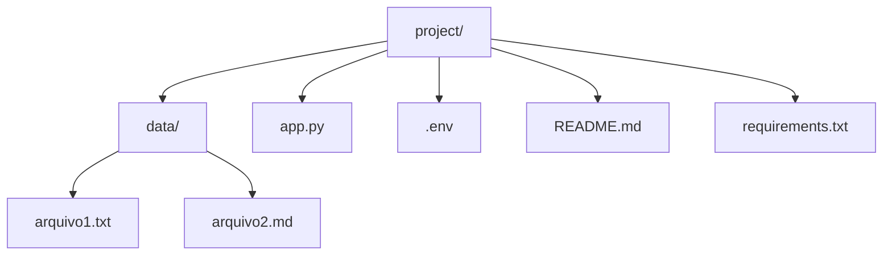

# 🤖 Chatbot Local RAG com Groq Cloud + Streamlit

Este projeto implementa um chatbot inteligente utilizando Groq Cloud para geração de respostas, com o modelo principal "llama-3.1-8b-instant" e fallback em "allam-2-7b". O frontend é construído em Streamlit e a lógica de respostas é limitada exclusivamente aos arquivos fornecidos pelo usuário (RAG local). As variáveis de ambiente são carregadas via arquivo .env.

O comportamento é semelhante ao Google NotebookLM, respondendo somente com base nos documentos anexados. Caso os arquivos não contenham informações suficientes, o chatbot responde:  
"Não há dados suficientes nos arquivos fornecidos para responder isso."

---

## 📂 Estrutura do Projeto



---

## ⚙️ Instalação e Setup

1. Crie um ambiente virtual (opcional, porém recomendado):

```powershell
python -m venv venv
venv\Scripts\activate
```

2. Instale as dependências:

```powershell
pip install streamlit groq python-dotenv
```

Ou:

```powershell
pip install -r requirements.txt
```

3. Crie o arquivo .env na raiz do projeto contendo:

```ini
GROQ_API_KEY=sua_chave_aqui
```

---

## ▶️ Executar o projeto

```powershell
streamlit run app.py
```

A aplicação rodará em: http://localhost:8501

---

## 🧠 Como funciona a busca local (RAG simples)

- O chatbot não usa internet.  
- Ele só responde com base no conteúdo da pasta "data".  
- Os arquivos são lidos e divididos em pequenos trechos (chunks).  
- Uma busca por similaridade textual encontra os trechos mais relevantes.  
- Somente esses trechos são enviados ao modelo Groq.  
- Se nenhum trecho for relevante, o chatbot informa que não há dados suficientes.

Esse comportamento evita alucinações e mantém as respostas alinhadas aos documentos.

---

## 📌 Principais funções

indexar_documentos: lê os arquivos da pasta data e gera chunks.  
buscar_contexto: retorna os trechos mais relevantes com base na pergunta.  
gerar_resposta: usa o contexto encontrado para construir o prompt enviado ao Groq Cloud.

Há fallback automático caso o modelo principal falhe.

---

## 🖥️ Interface Streamlit

A interface fornece:  
- Caixa de chat  
- Histórico de mensagens  
- Layout estilo mensagens do ChatGPT  
- Integração com Groq Cloud  
- Lógica de RAG local para respostas

---

## 🚨 Tratamento de erros

- Se a variável GROQ_API_KEY não existir → erro claro no início  
- Se o modelo principal falhar → fallback automático  
- Se não houver trechos relevantes → resposta "não há dados suficientes"  
- Se ambos os modelos falharem → mensagem de fallback padrão  

---

## 📄 Licença

Código livre para uso, modificação e distribuição.

